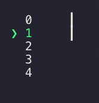

# ink-scrollbar [](https://travis-ci.org/karaggeorge/ink-scrollbar) [](https://github.com/sindresorhus/xo)

> Scrollbar Component for [Ink](https://github.com/vadimdemedes/ink)

Useful if you want to show a big list of items and don't want to display all of them at the same time.

Currently only works with simple (single-line) elements. Working on rewriting to work with any type of children passed.

Demo
---

Normal scrolling (code in the example below):



Adding items to the list:


Install
---

```
$ npm install ink-scrollbar
```

Usage
---

```js
const {h, render, Component, Text} = require('ink');
const Scrollbar = require('../lib');

const items = Array.apply(null, Array(15)).map((s, i) => i);

class Example extends Component {
  constructor() {
    super();
    this.state = {
      cursor: 0,
    };

    this.getCursor = this.getCursor.bind(this);
  }

  render() {
    return (
      <Scrollbar show={5} current={this.state.cursor} padding={3} highlight>
        {items.map(i => <Text>{this.getCursor(i)}{i}</Text>)}
      </Scrollbar>
    );
  }

  componentDidMount() {
    this.timer = setInterval(() => {
      this.setState({cursor: (this.state.cursor + 1) % items.length});
    }, 300);
  }

  componentWillUnmount() {
    clearInterval(this.timer);
  }

  getCursor(i) {
    const {cursor} = this.state;
    if(i==cursor) {
      return '❯\u00A0';
    } else {
      return '\u00A0\u00A0';
    }
  }
}

const unmount = render(<Example/>);

```

## Props

### Scrollbar

#### show

Type: `Number`
Default: `1`

Amount of items to show. If this is larger or equal to the amount of children given, all the items will be displayed and the scrollbar will not be rendered.

#### current

Type: `Number`
Default: `0`

The index of the currently selected item. This item will always be visible.

#### thumbCharacter

Type: `string`
Default: `┃`

This character is used for the thumb of the scrollbar.

#### padding

Type: `Number`
Default: `1`

Amount of space between the items and the scrollbar.

#### highlight
Type: `Boolean | Object`
Default: `false`

Wether to highlight or not the current item. If an object is passed, it will be passed to the wrapping `Text` component as props.

LICENSE
---

MIT © 2018 [George Karagkiaouris](https://github.com/karaggeorge)
